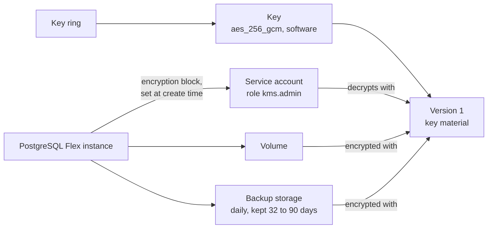
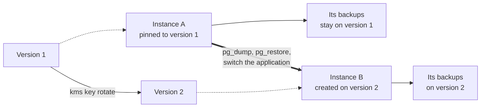
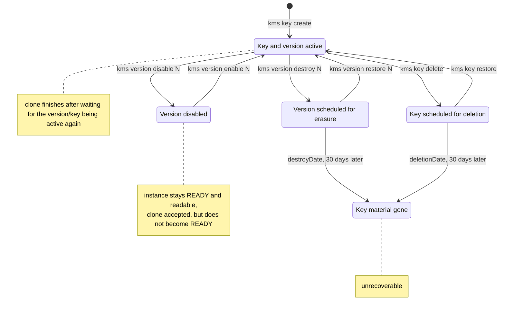
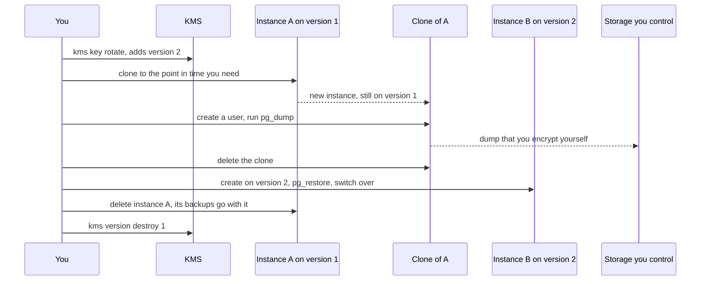

<!-- tags: dbaas, postgresql, kms, encryption, backup, key-management -->

# PostgreSQL Flex with KMS Encryption (Terraform)

## Terraform Example

Deploys a STACKIT PostgreSQL Flex instance whose volume **and backup storage** are
encrypted with a customer-managed key from [STACKIT KMS](https://docs.stackit.cloud/products/security/kms/),
together with the keyring, the key and the service account the database service uses to
unwrap that key.

```bash
terraform init
terraform plan
terraform apply
```

| File                     | Contents                                                     |
| ------------------------ | ------------------------------------------------------------ |
| `010-provider.tf`        | Provider and version constraint                              |
| `020-variables.tf`       | All values you need to adapt                                 |
| `030-service-account.tf` | Service account plus the KMS role the database service needs |
| `040-kms.tf`             | Keyring and key encryption key (KEK)                         |
| `050-postgresql.tf`      | Instance with `encryption`, plus a user and a database       |
| `060-outputs.tf`         | IDs, endpoint, key version, credentials                      |

## How it works



Terraform creates the keyring and the key first, then the service account and its role
assignment, and only then the instance — the instance refers to all three. The key
version is written into the instance at creation time and stays there for its whole life.

## Prerequisites

- A STACKIT project and a service account key with access to it, see _Authentication_.
- The project must be enabled for the private preview of customer-managed encryption.
- Terraform or OpenTofu, and the `stackit` CLI for the lookups in this guide.
- An egress IP range you can reach the database from.

## Configuration

Every value comes from a variable, none is hardcoded. Copy the example file and fill it in:

```bash
cp terraform.tfvars.example terraform.tfvars
```

| Variable                           | Required | Default                  | Meaning                                                                                                                                 |
| ---------------------------------- | -------- | ------------------------ | --------------------------------------------------------------------------------------------------------------------------------------- |
| `stackit_project_id`               | yes      | none, Terraform asks     | Project the instance and the key belong to. Find it with `stackit project list` or in the portal.                                       |
| `acl`                              | yes      | none, Terraform asks     | Networks allowed to reach the instance, e.g. `["203.0.113.10/32"]`. The instance is public; without a correct entry you cannot connect. |
| `stackit_service_account_key_path` | no       | `./keys/stackit-sa.json` | Key file Terraform authenticates with. The repository ignores `keys/`, so the file stays out of git.                                    |
| `stackit_region`                   | no       | `eu01`                   | Region for every resource in this example.                                                                                              |
| `instance_name`                    | no       | `pg-kms-example`         | Name of the instance; also used as prefix for keyring, key and service account.                                                         |
| `flavor_id`                        | no       | `2.4`                    | Instance size. List them with `stackit postgresflex flavor list`.                                                                       |
| `storage_class`                    | no       | `premium-perf2-stackit`  | Storage class. `stackit postgresflex flavor describe <flavor-id>` shows the valid ones.                                                 |
| `storage_size`                     | no       | `10`                     | Storage size in GB.                                                                                                                     |
| `postgres_version`                 | no       | `17`                     | PostgreSQL major version. `stackit postgresflex options --versions` lists them.                                                         |
| `backup_schedule`                  | no       | `0 2 * * *`              | Daily backup time in UTC. This is the only way to ask for a backup, see rule 7.                                                         |
| `retention_days`                   | no       | `32`                     | How long backups are kept, between 32 and 90.                                                                                           |
| `kek_key_version`                  | no       | `1`                      | Key version the instance is pinned to. See rule 1 below before you change it.                                                           |

Terraform reads `terraform.tfvars` automatically. The two other ways work as well:

```bash
terraform plan -var "stackit_project_id=xxxxxxxx-xxxx-xxxx-xxxx-xxxxxxxxxxxx"
TF_VAR_stackit_project_id=xxxxxxxx-xxxx-xxxx-xxxx-xxxxxxxxxxxx terraform plan
```

### Authentication

Terraform needs a service account key with permissions in the project. This account is
**not** the one in the `encryption` block; that one is created by this example.

```bash
mkdir -p keys
stackit service-account create --name terraform-sa
stackit service-account key create --email terraform-sa-xxxxxxx@sa.stackit.cloud > keys/stackit-sa.json
```

Assign the roles your project requires (at least project access plus `kms.admin` for the
KMS resources), then point `stackit_service_account_key_path` at the file. Keep the file
out of version control.

> Encryption with a customer-managed key is a **private preview** feature. The API
> rejects the `encryption` object for accounts that are not enabled for it.

## What the key protects

The API describes the object as the configuration for the instance's _"volume and
backup storage encryption"_. One key therefore covers the running database and every
backup it produces.

## The rules you have to plan for

These rules follow from the API specification in September 2026
(provider `0.113.0`, CLI `0.72.0`). They are the reason this example pins
`prevent_destroy` and writes the key version into the outputs.

### 1. The key version is fixed for the lifetime of the instance

`encryption` exists only in the create payload. Update, partial update and clone do not
carry it. In Terraform every field below `encryption` forces a replacement — and a
replacement deletes the instance **and its backups**. Raising `kek_key_version` in the
code is therefore data loss, not a configuration change. Keep `prevent_destroy` and
review every plan that says `must be replaced`.

### 2. Rotation creates a new version, it does not re-encrypt

`stackit kms key rotate` adds version N+1. The running instance stays on its version,
and so does every backup it has already written. There is currently no re-encryption of existing
data by using the PostgreSQL Flex API. Moving data under new key material means:
create a second instance on N+1, transfer with `pg_dump`/`pg_restore`, switch the
application, then retire the old instance.



The old instance and its backups keep version 1 alive. You can only retire that version
once the last backup that needs it has expired.

### 3. Restoring means cloning, and the clone keeps the key

PostgreSQL Flex has no `restore`. A recovery is
`stackit postgresflex instance clone` with a point in time, which creates an
**independent instance with a new endpoint**:

```bash
stackit postgresflex instance clone <instance-id> \
  --recovery-timestamp 2026-09-11T19:02:56+00:00 \
  --storage-size 10 --storage-class premium-perf2-stackit
```

The clone runs on the same key version as the source, and it overrides only name,
storage class and size. Plan the downtime for the endpoint change, not for a restore in
place.

### 4. A backup is only restorable while its key version is usable

Measured with a disabled version, a destroyed version and a deleted key:

| State of the key                                                                      | Running instance                                   | Clone from an existing backup                        |
| ------------------------------------------------------------------------------------- | -------------------------------------------------- | ---------------------------------------------------- |
| Key and version active                                                                | `READY`, readable                                  | becomes `READY`                                      |
| Version disabled (`kms version disable`)                                              | `READY`, readable, keeps writing scheduled backups | accepted, but does not become `READY`                |
| Version destroyed (`kms version destroy`)                                             | `READY`, readable                                  | accepted, but does not become `READY`                |
| Key deleted (`kms key delete`, within the 30 day window before real deletion happens) | `READY`, readable                                  | accepted, but does not become `READY`                |
| Version enabled again / key restored                                                  | unchanged                                          | clone finishes and becomes `READY` with correct data |

### 5. Deleting and destroying are scheduled, with a 30 day window

| Operation               | Level   | Effect                                                                                 | Way back                                  |
| ----------------------- | ------- | -------------------------------------------------------------------------------------- | ----------------------------------------- |
| `kms version disable N` | version | version becomes inactive                                                               | `kms version enable N`                    |
| `kms version destroy N` | version | key material scheduled for erasure, `destroyDate` 30 days later                        | `kms version restore N` within the window |
| `kms key delete`        | key     | whole key scheduled for deletion, `deletionDate` 30 days later, every version affected | `kms key restore` within the window       |
| `kms keyring delete`    | keyring | only succeeds on an empty keyring                                                      | none                                      |

The same four operations as transitions, together with what each state means for a
restore:



The three blocked states behave alike: the running instance keeps
answering queries, and a clone hangs. Only the way back differs, and only the two
scheduled states have a deadline.

### 6. Backups outlive the key window

`retention_days` accepts 32 to 90 days, so backups always live longer than the 30 day
window of a deleted key. After the window closes the key material is gone. A backup
whose key is gone is unrecoverable. Before you delete a key, make sure no
backup you still need is bound to it.

### 7. What you cannot do

| Wanted                               | Available |
| ------------------------------------ | --------- |
| Change the key of a running instance | no        |
| Clone with a different key           | no        |
| Re-encrypt existing backups          | no        |
| Trigger a backup manually            | no        |
| Download a backup                    | no        |
| Read which key version a backup used | no        |
| Automatic rotation on a schedule     | no        |

### 8. The service account needs decrypt, not read

PostgreSQL Flex unwraps the data key through the service account in the `encryption`
block. That requires `kms.key.version.decrypt`, which the role `kms.reader` does **not**
contain — it only carries `kms.key.get`, `kms.key.list`, `kms.keyring.get` and
`kms.keyring.list`. This example therefore assigns `kms.admin`. Verify in your project:

```bash
stackit project role list --project-id <project-id> -o json \
  | jq -r '.[] | select(.name|startswith("kms")) | "\(.name): \([.permissions[].name]|join(", "))"'
```

## Getting data out of a backup before you retire a key

A backup itself never leaves the platform. The only way to its content is a clone, and a
clone stays on the key version of its source — cloning enables you to specify a point in
time and it enables you to supply overrides for name, storage class and size, nothing else.
Cloning therefore rescues the data, not the key binding. Only a logical dump taken from the
clone is free of the key.

This is the order for a version you have to retire, a compromised one for example. Run
it while the version still works: after `version destroy` a clone will not become `READY`.



Four things decide whether this works:

- **Retire the version, not the key.** `kms key delete` schedules every version of the
  key, including the one instance B now runs on. `kms version destroy 1` hits only the
  compromised material.
- **One clone per point in time.** A clone restores a single moment, it costs money
  while it runs, and it is not exact to the second — check its content, not its
  timestamp.
- **Instance B starts without history.** It has no backup until its first one completes,
  and a fresh backup needs time. Verify that before you delete instance A.
- **The 30 day window is your safety net.** `kms version restore N` brings a destroyed
  version back within the window, and clones that were hanging become `READY`. After the
  window the backups bound to that version are lost.

## Operating recommendations

- **Record the key version** next to the instance. Nothing in a backup tells you later
  which version it needs. The output `kek_key_version` is there for that reason.
- **One key per instance.** The API offers no reverse lookup "which instance uses this
  version", and `ListInstances` does not return the encryption block. A key shared by
  several consumers can only be retired once all of them are gone.
- **Keep a logical backup outside STACKIT** for anything that must survive the key. A
  `pg_dump` that you encrypt yourself does not depend on the KEK.
- **Prove restorability before you retire a key**: clone to a recent point in time,
  check a sample, delete the clone. A backup list only proves that files exist.
- **Check that a base backup exists before you rely on a restore.** Without one,
  `clone` answers `404 backup not found`. The recovery point may lie after the last
  backup and a freshly created instance without any
  listed backup cannot be restored at all. Do not rely on the target being exact to the
  second. Check the content of the clone, not the timestamp.

## Related examples

| Example                                                                       | Why it is relevant here                                                                                                                      |
| ----------------------------------------------------------------------------- | -------------------------------------------------------------------------------------------------------------------------------------------- |
| [`iaas-volume-encryption`](../iaas-volume-encryption)                         | The same KMS key type for an encrypted block storage volume, including a migration path from an unencrypted volume.                          |
| [`ske-encrypted-volumes`](../ske-encrypted-volumes)                           | KMS for SKE storage classes. It assigns `kms.admin` like this example and adds the service account impersonation (act-as) pattern.           |
| [`iam-custom-roles`](../iam-custom-roles)                                     | If `kms.admin` is too broad for your project, build a custom role that carries only `kms.key.version.decrypt` and `kms.key.version.encrypt`. |
| [`terraform-pg-backend-state-locking`](../terraform-pg-backend-state-locking) | A different use of PostgreSQL Flex: as a Terraform state backend with locking, without encryption.                                           |
| [`dbaas-otel-collect-metrics`](../dbaas-otel-collect-metrics)                 | Collect metrics from the same database type with OpenTelemetry.                                                                              |

## Cleaning up

`terraform destroy` stops with `Resource instance cannot be destroyed` as long as
`prevent_destroy` is set on the instance. That guard is deliberate — removing the
instance removes its backups with it. Comment the `lifecycle` block in
`050-postgresql.tf` out, run the destroy, then put it back:

```hcl
  # comment this, if you really want to replace or destroy this instance:
  lifecycle {
    prevent_destroy = true
  }
```

The destroy then removes the instance and schedules the key for deletion, which opens
the 30 day window from rule 5. `stackit kms key restore` brings the key back within
that window. The provider does not delete the keyring; it only removes it from the
Terraform state. Delete it yourself once the window of its last key has passed:

```bash
stackit kms keyring delete <keyring-id>   # only works once the key is gone
```
