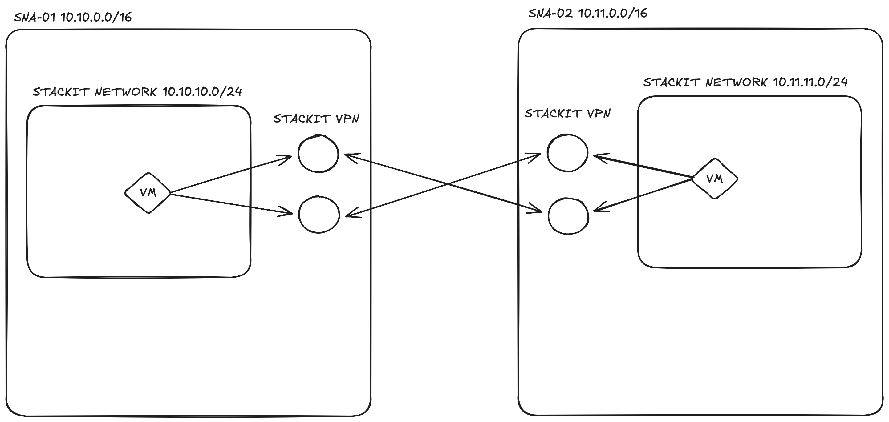

<!-- tags: vpn, networking, ipsec, site-to-site, ha, bgp -->

# STACKIT-to-STACKIT VPN Gateway

This example leverages the STACKIT VPN service to establish a secure, Highly Available (HA) connection between two separate STACKIT Network Areas (SNAs).

The connection utilizes **BGP (Border Gateway Protocol)** to automatically propagate and learn routing information between the two networks.

## When to use this example

**Use BGP route-based when:**

- The remote peer **supports BGP** (all major cloud providers — AWS, Azure, GCP — and modern firewalls)
- The network topology **changes dynamically** — new subnets on either side are advertised automatically without any Terraform change
- You need **fast, automatic failover** — BGP detects a dead tunnel and reroutes within seconds, without waiting for static route convergence
- You are connecting **two STACKIT SNAs** to each other — this is the recommended default for STACKIT-to-STACKIT connectivity

**Do not use BGP route-based when:**

- The remote peer **does not support BGP** — use [route-based](../vpn-route-stackit-stackit/) (if it has VTI) or [policy-based](../vpn-policy-stackit-stackit/) (if it is legacy)

## Choosing the right VPN type

|                             | Policy-based              | Route-based                 | BGP route-based                   |
| --------------------------- | ------------------------- | --------------------------- | --------------------------------- |
| `routing_type`              | `POLICY_BASED`            | `ROUTE_BASED`               | `BGP_ROUTE_BASED`                 |
| Routes defined by           | Traffic selectors         | `static_routes`             | BGP advertisements                |
| Remote subnet changes       | Terraform change required | Terraform change required   | Automatic                         |
| BGP required on remote peer | No                        | No                          | Yes                               |
| Typical use case            | Legacy appliances         | On-prem appliances with VTI | Cloud providers, modern firewalls |

> **Note:** Currently, native SNA peering is not available in STACKIT. Therefore, provisioning a VPN connection is the required method to interconnect two SNAs. This will change in the future once native SNA peering is released.



## How to Test the Connection

Once the deployment is complete, you can verify the VPN tunnel using the provisioned debug machines:

1. **SSH** into the first debug machine using its public IP (`vpn01_public_ip`).
2. **Ping** the private IP of the second debug machine (`vpn02_private_ip`) across the tunnel.

```bash
# SSH into the first debug machine
ssh debug@<vpn01_public_ip>
# password: debug123

# Example test command once connected
ping <vpn02_private_ip>
```
